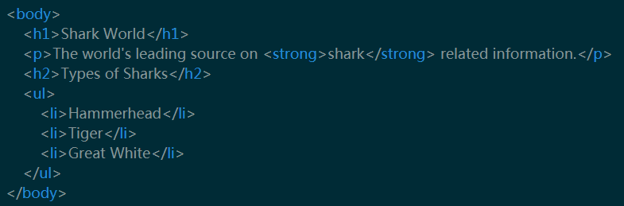
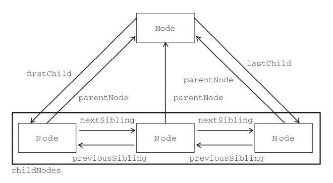

# 理解DOM

资料：

**➹：**[理解DOM_JavaScript, DOM 教程_w3cplus](https://www.w3cplus.com/javascript/understanding-the-dom.html)

**➹：**[How To Understand and Modify the DOM in JavaScript - DigitalOcean](https://www.digitalocean.com/community/tutorials/introduction-to-the-dom)

## ★总结

- 浏览器生成的DOM与其HTML源代码之间的区别：
  - DOM被客户端（可能是浏览器）JavaScript修改
  - 浏览器会自动修复源代码中的错误
- 可以使用`nodeValue`属性获取文本或注释节点的值。可以通过`nodeName`属性来获取元素的标签名。
- DOM中有两个属性可以访问到父节点：`parentNode`和`parentElement`。那么拿到祖先节点呢？很简单，直接使用链式访问即可！
- 如果是爷爷节点，我们一般会叫它为祖先节点！超过一层嵌套的任何节点通常称为**后代节点**。
- 关于兄弟节点，节点的兄弟节点是**DOM中同一级别上的任何节点**。兄弟姐妹**不必是同一个类型的节点** —— 文本、元素和注释节点都可以是兄弟节点。之前一直以为是同一类型的节点！
- 一般API没有「Node」字眼或者出现「Element」字眼的，都是针对元素节点！
- 这篇文章主要介绍了JavaScript中**DOM的基本知识**，通过前面的学习，知道了如何**访问DOM中的任何元素**，**遍历DOM中的任何节点**，**并修改DOM本身**，也可以**根据自己需要删除想要删除的DOM节点**。这些DOM API可以帮助我们**动态的对DOM**进行**增、删、改、查**相关的事情。言外之意，**使用上面的API可以对DOM做你自己想做的一些事情。**

## ★Q&A

### ①元素节点和文本节点的关系？

一般来说元素节点是包含文本节点的，除非你让文本节点与html这个根元素为兄弟关系！

```
document.nodeType //9
元素节点 //1
文本节点 //3
注释节点 //8
```

```html
<!-- My document -->
<html>
<head>
  <title>My Document</title>
</head>
<body>
  <h1>Header</h1>
  <p>
    Paragraph
  </p>
</body>
</html>
```


**➹：**[DOM中的空白符 - Web 开发者指南 - MDN](https://developer.mozilla.org/zh-CN/docs/Web/Guide/API/DOM/Whitespace_in_the_DOM)

### ②元素节点有nodeValue这个API吗？

对于文本节点，nodeValue 属性包含文本。

对于属性节点，nodeValue 属性包含属性值。

nodeValue 属性对于文档节点和元素节点是不可用的。

**➹：**[DOM节点中属性nodeName、nodeType和nodeValue的区别 - linder0209 - ITeye博客](https://linder0209.iteye.com/blog/1458823)

### ③对文本节点的深入了解？

文本节点顾名思义指向文本的节点，网页上看到的文字内容都属于文本节点。该节点简单直观……

**➹：**[深入理解DOM节点类型第二篇——文本节点Text - 小火柴的蓝色理想 - 博客园](https://www.cnblogs.com/xiaohuochai/p/5815193.html)

### ④`parentElement`和`parentNode`的区别？

`parentElement`和`parentNode`类似，都表示一个元素的父元素，但两者还是有一定的差异性：

- `parentNode`是W3C标准规范定义的一个属性，用节点的形式返回一个节点的父节点
- `parentElement`最早是IE浏览器才支持的一个属性，功能基本和`parentNode`一致，其也是Firefox 9和DOM4的新功能
- 当一个节点的父节点的`nodeType !==1`的时候，即父节点不是`Element`的时候，通过`parentElement`得到的父节点会是`null`

如：

```js
document.body.parentNode; // => the <html> element 
document.body.parentElement; // => the <html> element 
document.documentElement.parentNode; // => the document node 
document.documentElement.parentElement; // => null
```

③对文本

由于`<html>`元素（ `document.documentElement` ）没有作为元素的父元素，因此`parentElement`为`null` 。 （还有其他更不可能的情况， `parentElement`可能为`null` ，但**您可能永远不会遇到它们**。也就是虽然存在，但就是用不到！）

> **只要记住，名称中带有element的属性总是返回Element或null 。 没有的属性可以返回任何其他类型的节点。通常，遍历DOM时，parentNode更常用。**

> 总之parentNode着重Node，而parentElement则是着重Element

注意：

下面是由**每个文档所包含的根元素**组成的图表。即使将一个空白HTML文件加载到浏览器中，这三个节点也将被添加到DOM中。

| 属性                       | 节点        | 节点类型        |
| :------------------------- | :---------- | :-------------- |
| `document`                 | `#document` | `DOCUMENT_NODE` |
| `document.documentElement` | `html`      | `ELEMENT_NODE`  |
| `document.head`            | `head`      | `ELEMENT_NODE`  |
| `document.body`            | `body`      | `ELEMENT_NODE`  |

所以前面的例子里边就是说html这个根元素的父节点是文档节点！

### ⑤**childNodes**和**children**的区别？



前者是子节点，后者则是为元素的子节点

它们都是属性，各自都返回一个伪数组，而且前者是一个动态集合！

针对于前者，我们不想要空白文本节点的话，可以使用JavaScript生成HTML

那么前者是不是一点用也没用呢？非也，你看p元素就知道了，当我们的HTML源码没有空白符，拿到p元素的文本节点简直是轻而易举的事儿哈！

关于选择某个节点的姿势：

- **firstChild**：第一个子节点
- **lastChild**：最后一个子节点
- **firstElementChild**：第一个子元素节点
- **lastElementChild**：最后一个子元素节点

> 注意属性也是API的一种体现哈！

### ⑥关于兄弟节点那些API？

> 注意：定位到一个兄弟节点就可以开始使用下边这些API了！

- **previousSibling**：前一个兄弟节点

- **nextSibling**：下一个兄弟节点

- **previousElementSibling**：前一个兄弟元素节点

- **nextElementSibling**：后一个兄弟元素节点

兄弟属性与子节点的工作方式相同，其中**有一组属性遍历所有节点，以及一组仅用于元素节点的属性**。`previousSibling`和`nextSibling`将会获得前一个和下一个节点；`previousElementSibling`和`nextElementSibling`只获得元素节点。

> 前方那4个API都是先遍历一遍后所拿到的结果！



### ⑦如何更改DOM？

> 做一个TODO-List应用就是最好的体现！因为这涉及到创建、修改、删除操作哈！

#### 创建节点

> 使用姿势：document创建元素或文本节点，告诉节点你要创建文本内容或者HTML内容

- **createElement()**：创建一个新的元素节点

- **createTextNode()**：创建一个新的文本节点

- **node.textContent**：获取或设置元素节点的文本内容

- **node.innerHTML**：获取或设置元素的HTML内容

在给元素设置内容的时候：

> 注意，使用`innerHTML`方法给元素添加内容时会引起[XSS](https://developer.mozilla.org/en-US/docs/Web/API/Element/innerHTML#Security_considerations)风险，因为内联JavaScript可以添加到元素中。因此，建议使用`textContent`代替`innerHTML`。

即便做了以上操作之后，浏览器中也看不到任何的效果。主要是原因是**我们只是创建了元素和文本节点，但没有插入到文档中**。

那么我们该如何才能够在浏览器中能看到JavaScript动态创建的元素和文本呢？

#### 将节点插入DOM中

> 使用姿势：告诉父节点，我要往你身上插入节点

为了能在页面上看到创建的新文本节点和元素，我们需要将它们插入到`document`中。

- **node.appendChild()**：添加一个节点作为父元素的最后一个子元素

- **node.insertBefore()**：在指定的同级节点前将节点插入父元素

- **node.replaceChild()**：用一个新节点替换现有节点

有了这几个API，我们就可以往父元素的开始、中间或后面添加元素了，即可以在父元素里边的任意位置！

各自的使用姿势：

```js
//todoList是父节点，告诉它你要添加子节点，该子节点是newTodo,即，我们动态创建的节点。类似于正常排队！即有先来后到之分！
todoList.appendChild(newTodo) //作为最后一个子元素

//在nextSibling的前面添加个新子节点newNode，类似于插队，可以插在排在第一位的那个人，那么你就成为了第一位
parentNode.insertBefore(newNode, nextSibling);

//与上边那个一样需要添加两个参数，把第二个参数节点弄成是第一个参数节点！类似于重新赋值节点的调调！或者说看这人不顺眼就把这人踢出队伍里边，让它队伍里边消失滚动！
parentNode.replaceChild(newNode, oldNode);
```

总之，在JavaScript中，我们可以通过`appendChild()`、`insertBefore()`和`replaceChild()`的组合，**可以在DOM中的任何地方插入节点和元素。**

#### 从DOM中删除节点

> 使用姿势：告诉父节点，你儿子GG了！

> 增是创建后插入之意，改是插入时替换之意，删是直接删除非替换之意，查是获取DOM元素以及查看页面内容之意！

通过上边两步操作，我们知道了如何在DOM中**创建元素**以及将创建的元素**插入**到DOM中，并且**修改**现有的DOM元素。最后一步来学习如何从DOM中**删除**现有节点。可以使用`removeChild()`从父节点中删除一个子节点，并且可以使用`remove()`删除节点本身。

- **node.removeChild()**：删除子节点

- **node.remove()**：删除节点

具体使用：

removeChild()：告诉父节点，你即将要移除的子节点是？？？随便

```js
// 删除最后一个子节点 
todoList.removeChild(todoList.lastElementChild) 
// 删除第一个子节点 
todoList.removeChild(todoList.firstElementChild) 
// 删除指定的子节点 
todoList.removeChild(todoList.children[1])
```

remove()：告诉自己，自己要移除自己，我的离家出走是自己决定的，与他人无关！再见了我的老父亲！

```js
// 删除ul中的第一个li 
todoList.firstElementChild.remove() 
// 删除ul中的最后一个li 
todoList.lastElementChild.remove()
```

总之，使用`removeChild()`和`remove()`可以从DOM中**删除任何节点**。除此之外还有一个更诡异的方法可以删除子节点，那就是将父元素的`innerHTML`属性值设置为空字符串（`' '`）。使用这种方法将会**一次性将父元素的所有节点删除**，不过这不是首选方法，因为你无法删除指定的节点。